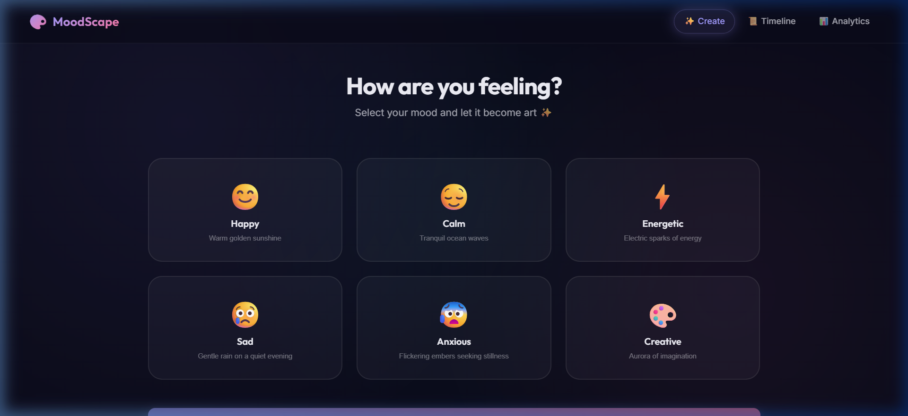
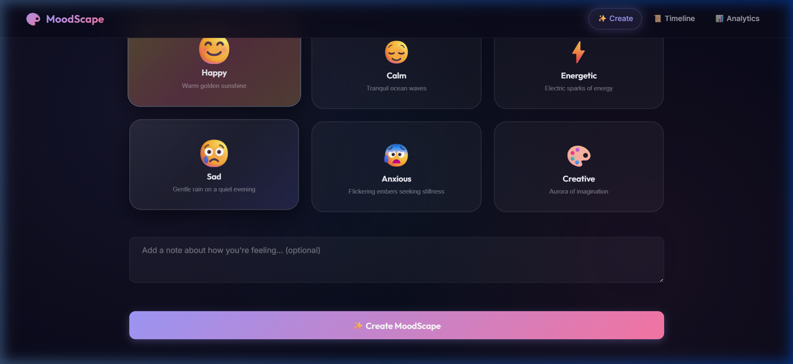
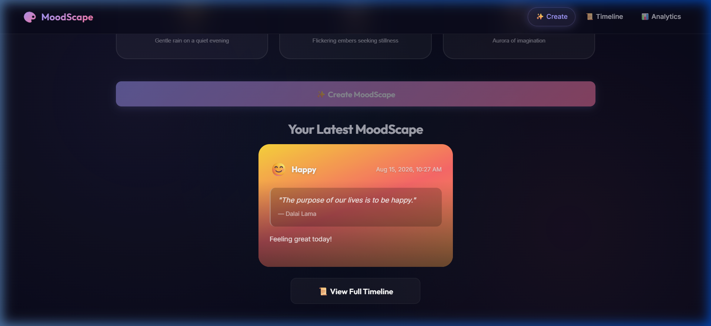
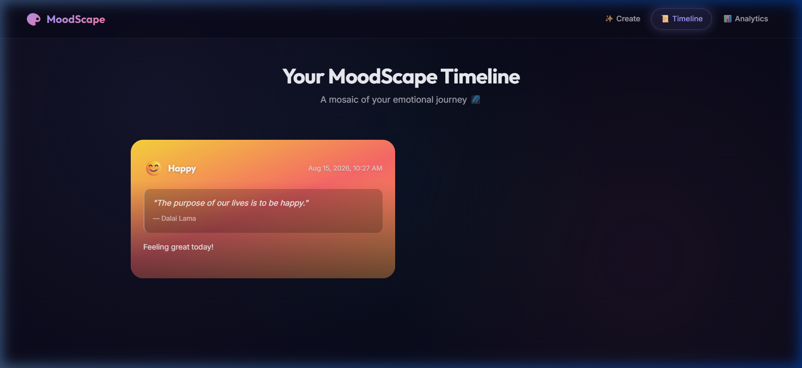
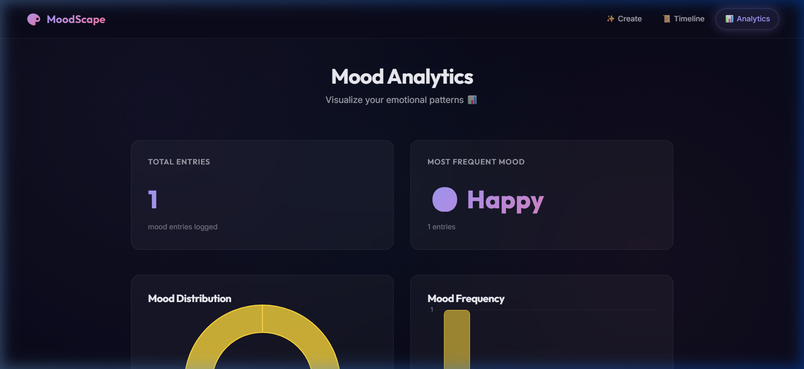

<p align="center">
  
  
  
  
  
</p>

<h1 align="center">🎨 MoodScape</h1>

<p align="center">
  <strong>Turn your emotions into art ✨</strong>
  <br />
  A mood-based generative art journal — select your mood, add a note, and watch it transform into a beautifully styled mood card with curated quotes, gradients, and color palettes.
</p>

---

## 📸 Screenshots

| Home — Mood Selection | Mood Selected + Note |
|:-:|:-:|
|  |  |

| Generated Mood Card | Timeline View |
|:-:|:-:|
|  |  |

| Analytics Dashboard |
|:-:|
|  |

---

## ✨ Features

- **🎭 Mood Selection** — Choose from 6 expressive moods: Happy, Calm, Energetic, Sad, Anxious, Creative
- **🖼️ Generative Mood Cards** — Each mood entry generates a unique card with dynamic gradients, curated quotes, and color palettes
- **📝 Personal Notes** — Attach optional notes to capture how you're feeling in the moment
- **📜 Timeline View** — Browse your emotional journey as a mosaic of mood cards ordered by date
- **📊 Analytics Dashboard** — Visualize emotional patterns with doughnut and bar charts (Mood Distribution & Mood Frequency)
- **🎨 Dynamic Color Palettes** — Every mood has a hand-picked color palette with unique gradient rotations for visual variety
- **💬 Inspirational Quotes** — Auto-paired quotes from notable authors matched to your mood
- **🌙 Dark Mode UI** — Sleek glassmorphism-based dark interface with smooth animations

---

## 🏗️ Tech Stack

| Layer | Technology | Purpose |
|-------|-----------|---------|
| **Backend** | [FastAPI](https://fastapi.tiangolo.com/) | REST API with automatic OpenAPI docs |
| **Backend Runtime** | [Uvicorn](https://www.uvicorn.org/) | ASGI server for serving FastAPI |
| **Data Validation** | [Pydantic](https://docs.pydantic.dev/) | Request/response model validation |
| **Frontend** | [React 19](https://react.dev/) | UI component library |
| **Bundler** | [Vite 8](https://vite.dev/) | Fast HMR dev server and build tool |
| **Routing** | [React Router 7](https://reactrouter.com/) | Client-side page routing |
| **Charts** | [Chart.js](https://www.chartjs.org/) + [react-chartjs-2](https://react-chartjs-2.js.org/) | Analytics visualizations |
| **Linting** | [OxLint](https://oxc.rs/) | Ultra-fast JavaScript/TypeScript linter |

---

## 📁 Project Structure

```
MoodScape/
├── backend/
│   ├── main.py                 # FastAPI app — routes, CORS, in-memory storage
│   ├── requirements.txt        # Python dependencies (fastapi, uvicorn)
│   └── data/
│       ├── __init__.py
│       ├── palettes.py         # Mood → color palette mappings (6 moods)
│       └── quotes.py           # Mood → inspirational quotes collection
│
├── frontend/
│   ├── index.html              # HTML entry point with SEO meta tags
│   ├── package.json            # Node dependencies and scripts
│   ├── vite.config.js          # Vite + React plugin configuration
│   └── src/
│       ├── main.jsx            # React DOM entry point
│       ├── App.jsx             # Router setup (/, /timeline, /analytics)
│       ├── api.js              # API client — fetch, create, delete moods
│       ├── index.css           # Global styles — dark theme, glassmorphism
│       └── components/
│           ├── Navbar.jsx      # Top navigation with route highlighting
│           ├── MoodSelector.jsx # Mood grid with gradient preview cards
│           ├── MoodCard.jsx    # Individual mood entry card (quote + note)
│           ├── Timeline.jsx    # Chronological feed of mood cards
│           └── Analytics.jsx   # Doughnut + bar chart analytics dashboard
│
└── screenshots/                # App screenshots for documentation
    ├── 01_home.png
    ├── 02_mood_selected.png
    ├── 03_mood_card.png
    ├── 04_timeline.png
    └── 05_analytics.png
```

---

## 🚀 Getting Started

### Prerequisites

- **Python 3.10+** — [Download](https://www.python.org/downloads/)
- **Node.js 18+** — [Download](https://nodejs.org/)

### 1. Clone the Repository

```bash
git clone https://github.com/thepremkumar/moodscape.git
cd moodscape
```

### 2. Start the Backend

```bash
cd backend
pip install -r requirements.txt
uvicorn main:app --reload
```

The API will be running at **http://localhost:8000**

> 💡 Visit **http://localhost:8000/docs** for the interactive Swagger UI

### 3. Start the Frontend

```bash
cd frontend
npm install
npm run dev
```

The app will be running at **http://localhost:5173**

---

## 📡 API Reference

Base URL: `http://localhost:8000`

### Moods

| Method | Endpoint | Description |
|--------|----------|-------------|
| `GET` | `/api/moods` | Get all mood entries (newest first) |
| `POST` | `/api/moods` | Create a new mood entry |
| `DELETE` | `/api/moods/{mood_id}` | Delete a mood entry by ID |

### Analytics

| Method | Endpoint | Description |
|--------|----------|-------------|
| `GET` | `/api/moods/analytics` | Get mood distribution and stats |

### Quotes & Palettes

| Method | Endpoint | Description |
|--------|----------|-------------|
| `GET` | `/api/quotes/{mood}` | Get a random quote for a mood |
| `GET` | `/api/palettes` | Get all available mood palettes |
| `GET` | `/api/palettes/{mood}` | Get the palette for a specific mood |

### Example: Create a Mood Entry

```bash
curl -X POST http://localhost:8000/api/moods \
  -H "Content-Type: application/json" \
  -d '{"mood": "happy", "note": "Feeling great today!"}'
```

**Response:**

```json
{
  "id": "a1b2c3d4-...",
  "mood": "happy",
  "note": "Feeling great today!",
  "quote": {
    "text": "The purpose of our lives is to be happy.",
    "author": "Dalai Lama"
  },
  "palette": {
    "name": "Happy",
    "emoji": "😊",
    "primary": "#FFD93D",
    "secondary": "#FF6B6B",
    "accent": "#FFA94D",
    "gradient": ["#FFD93D", "#FF6B6B", "#FFA94D"],
    "rotation": 247,
    "bg_gradient": "linear-gradient(247deg, #FFD93D 0%, #FF6B6B 50%, #FFA94D 100%)"
  },
  "created_at": "2026-08-15T10:27:00.000000"
}
```

---

## 🎭 Supported Moods

| Mood | Emoji | Palette | Description |
|------|-------|---------|-------------|
| Happy | 😊 | `#FFD93D` → `#FF6B6B` → `#FFA94D` | Warm golden sunshine radiating joy |
| Calm | 😌 | `#74B9FF` → `#A29BFE` → `#81ECEC` | Tranquil ocean waves under moonlight |
| Energetic | ⚡ | `#FD79A8` → `#FDCB6E` → `#E17055` | Electric sparks of unstoppable energy |
| Sad | 😢 | `#636E72` → `#2D3436` → `#6C5CE7` | Gentle rain on a quiet evening |
| Anxious | 😰 | `#E17055` → `#D63031` → `#FDCB6E` | Flickering embers seeking stillness |
| Creative | 🎨 | `#A29BFE` → `#FD79A8` → `#00CEC9` | Aurora borealis of imagination |

---

## 🛠️ Development

### Backend

```bash
# Run with auto-reload
uvicorn main:app --reload --port 8000

# API docs available at
# Swagger UI:  http://localhost:8000/docs
# ReDoc:       http://localhost:8000/redoc
```

### Frontend

```bash
# Development server with HMR
npm run dev

# Production build
npm run build

# Preview production build
npm run preview

# Lint with OxLint
npm run lint
```

---

## 📝 Notes

- **Storage**: The backend uses in-memory storage — data resets when the server restarts. This is intentional for a lightweight demo; swap in a database (PostgreSQL, SQLite, etc.) for persistence.
- **CORS**: Configured for `localhost:5173` (Vite dev server). Update `allow_origins` in [main.py](backend/main.py) for production deployments.
- **Quotes**: Curated collection of mood-appropriate quotes stored in [quotes.py](backend/data/quotes.py). Easily extensible — just add new entries to the dictionary.

---

## 📄 License

This project is open source and available under the [MIT License](LICENSE).

---

<p align="center">
  Made with 💜 by <strong>Prem</strong>
</p>
